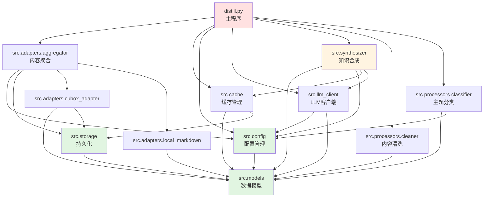
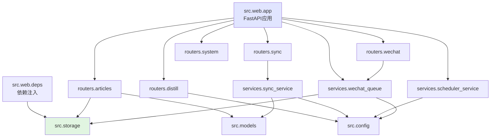

# Bo-Distiller 模块依赖分析报告

## 1. 项目结构概览

```
bo-distiller/
├── src/                      # 核心库
│   ├── models.py            # 数据模型（基础层，被广泛依赖）
│   ├── config.py            # 配置管理（基础层，被广泛依赖）
│   ├── storage.py           # 数据持久化（基础层）
│   ├── cache.py             # 缓存管理
│   ├── llm_client.py        # LLM 客户端封装
│   ├── synthesizer.py       # 知识合成核心逻辑
│   ├── adapters/            # 内容源适配器
│   │   ├── base.py          # 基类定义
│   │   ├── aggregator.py    # 聚合器（协调所有 adapter）
│   │   ├── cubox_adapter.py # Cubox 适配器
│   │   └── local_markdown.py# 本地文件适配器
│   ├── processors/          # 内容处理器
│   │   ├── classifier.py    # 主题分类器
│   │   ├── cleaner.py       # 内容清洗
│   │   └── smart_classifier.py # 智能分类器
│   ├── services/            # 后台服务
│   │   ├── scheduler_service.py  # 定时任务调度
│   │   ├── sync_service.py       # 同步服务
│   │   ├── wechat_downloader.py  # 微信文章下载（旧）
│   │   ├── wechat_queue.py       # 微信下载队列
│   │   └── wechat_native/        # 微信本地化下载
│   │       ├── api.py
│   │       ├── auth.py
│   │       └── downloader.py
│   └── web/                 # Web 应用
│       ├── app.py           # FastAPI 应用工厂
│       ├── deps.py          # 依赖注入
│       └── routers/         # API 路由（8个模块）
├── cli/                     # 命令行工具
│   └── wechat_native.py    # 微信本地化 CLI
├── distill.py              # 主程序入口
└── web_ui.py               # Web UI 入口
```

**统计**:
- 核心模块: 6 个（models, config, storage, cache, llm_client, synthesizer）
- 适配器: 4 个（base, aggregator, cubox, local_markdown）
- 处理器: 3 个（classifier, cleaner, smart_classifier）
- 服务: 8 个（scheduler, sync, wechat 相关）
- Web 路由: 9 个
- 入口脚本: 3 个（distill, web_ui, cli）

---

## 2. 核心依赖关系

### 2.1 基础层（零依赖，被广泛使用）

```
src.models (数据模型)
├─ 被依赖: distill, storage, cache, config, adapters, processors, web routers
└─ 说明: 定义 Article, SourceConfig, SystemConfig 等核心数据结构

src.config (配置管理)
├─ 依赖: src.models
├─ 被依赖: distill, services, web, adapters, processors
└─ 说明: 加载 YAML 配置，提供全局配置单例

src.storage (持久化)
├─ 依赖: src.models
├─ 被依赖: cache, adapters, services, web
└─ 说明: SQLite 数据库操作，文章/同步状态/知识文档存储
```

**分析**: 这三个模块构成项目的基础架构层，设计合理，依赖方向清晰。

---

### 2.2 业务逻辑层

```
src.cache (缓存管理)
├─ 依赖: src.models, src.storage
├─ 被依赖: distill
└─ 说明: 多层缓存（原始/清洗/主题/批次/最终），支持断点续传

src.llm_client (LLM 客户端)
├─ 依赖: src.config, src.models
├─ 被依赖: distill, synthesizer
└─ 说明: 封装多个 LLM 提供商，统一调用接口

src.synthesizer (知识合成)
├─ 依赖: src.models, src.config, src.cache, src.llm_client
├─ 被依赖: distill, web.routers.distill
└─ 说明: 两阶段合成（批次提取 → 知识整合），核心蒸馏逻辑
```

**分析**: 业务逻辑层模块职责清晰，synthesizer 是核心引擎，依赖关系单向。

---

### 2.3 适配器层（插件式架构）

```
src.adapters.base
└─ 定义 SourceAdapter 抽象接口

src.adapters.cubox_adapter
├─ 依赖: src.models, src.storage, src.adapters.base
└─ 说明: Cubox CLI 集成

src.adapters.local_markdown
├─ 依赖: src.models, src.adapters.base
└─ 说明: 本地 Markdown 文件源

src.adapters.aggregator
├─ 依赖: src.models, src.config, src.storage, cubox_adapter, local_markdown
└─ 说明: 聚合所有适配器，统一入口
```

**分析**: 适配器之间完全独立，通过 aggregator 协调，符合开放封闭原则。

---

### 2.4 处理器层

```
src.processors.cleaner
├─ 依赖: src.models
└─ 说明: 内容清洗（去重、格式化）

src.processors.classifier
├─ 依赖: src.models, src.config
└─ 说明: 基于关键词的主题分类

src.processors.smart_classifier
├─ 依赖: src.models, src.config
└─ 说明: 基于 LLM 的智能分类（未充分使用）
```

**分析**: 处理器之间独立，可插拔设计良好。

---

### 2.5 服务层（后台任务）

```
src.services.scheduler_service
├─ 依赖: src.config
└─ 说明: 基于 APScheduler 的定时任务调度

src.services.sync_service
├─ 依赖: src.config, src.models, src.adapters.aggregator
└─ 说明: 定时同步内容源

src.services.wechat_queue
├─ 依赖: src.storage, src.models, src.config
└─ 说明: 微信文章下载队列管理（新版）

src.services.wechat_downloader
├─ 依赖: src.storage, src.models, src.config
└─ 说明: 微信文章下载（旧版，使用第三方 API）

src.services.wechat_native/
├─ api.py, auth.py, downloader.py
└─ 说明: 微信本地化下载（新版，官方登录）
```

**分析**: 
- wechat_downloader（旧）和 wechat_native（新）功能重叠，建议统一
- services 层与核心业务逻辑解耦良好

---

### 2.6 Web 层

```
src.web.app (FastAPI 应用)
├─ 依赖: src.config, services, routers
└─ 说明: 应用工厂，生命周期管理

src.web.deps
├─ 依赖: src.storage
└─ 说明: 依赖注入（提供数据库连接等）

src.web.routers/* (9 个路由模块)
├─ articles, config, distill, knowledge, prompts, sync, system, topics, wechat, wechat_native
├─ 依赖: src.config, src.storage, src.models, services
└─ 说明: RESTful API 端点
```

**分析**: Web 层与业务逻辑层分离良好，通过 routers 提供 API 接口。

---

## 3. 入口脚本依赖分析

### 3.1 distill.py (主程序)

```python
依赖模块:
  → src.adapters.aggregator     # 内容聚合
  → src.cache                   # 缓存管理
  → src.config                  # 配置
  → src.llm_client              # LLM 调用
  → src.models                  # 数据模型
  → src.processors.cleaner      # 内容清洗
  → src.processors.classifier   # 主题分类
  → src.synthesizer             # 知识合成

执行流程:
  1. 获取文章 (aggregator)
  2. 清洗内容 (cleaner)
  3. 主题分类 (classifier)
  4. AI 合成 (synthesizer + llm_client)
  5. 输出文档
```

**分析**: distill.py 是唯一的"高耦合"模块（依赖 7 个核心模块），但这是合理的，因为它是主流程编排器。

---

### 3.2 web_ui.py (Web 服务入口)

```python
依赖模块:
  → src.web.app   # 启动 FastAPI 应用

简单入口，实际逻辑在 src.web.app 和 routers 中
```

---

### 3.3 cli/wechat_native.py

```python
依赖模块:
  → src.services.wechat_native.*

独立 CLI 工具，不依赖主流程
```

---

## 4. 循环依赖检测

✅ **未发现循环依赖**

所有依赖关系都是单向的，层次分明：
```
基础层 (models, config, storage)
  ↓
业务逻辑层 (cache, llm_client, synthesizer)
  ↓
适配器/处理器层 (adapters, processors)
  ↓
服务层 (services)
  ↓
Web 层 (web)
  ↓
入口层 (distill, web_ui)
```

---

## 5. 潜在问题分析

### 5.1 功能重叠

**问题**: 微信下载功能存在两套实现
- `src.services.wechat_downloader` (旧版，使用第三方 API)
- `src.services.wechat_native` (新版，官方登录)

**建议**: 
1. 明确主推方案（建议使用 wechat_native）
2. 废弃或归档旧版实现
3. 统一配置和 API 接口

---

### 5.2 未充分使用的模块

**smart_classifier.py**: 智能分类器未在主流程中使用，只有基础的 classifier 被使用。

**建议**: 
- 如果 smart_classifier 功能更优，替换 classifier
- 否则移除或归档到实验目录

---

### 5.3 适配器扩展性

**当前适配器**: cubox, local_markdown

**潜在扩展**: RSS、Notion、Obsidian、Logseq 等

**建议**: 
- 适配器架构设计良好，易于扩展
- 考虑提供适配器开发模板和文档
- 可以将 wechat_native 也封装为 adapter

---

### 5.4 配置文件依赖

**问题**: 多个 YAML 配置文件（config.yaml, sources.yaml, prompts.yaml, topics.yaml）

**优点**: 关注点分离
**缺点**: 新用户需要理解多个配置文件的关系

**建议**: 
- 提供配置文件模板和详细注释
- 考虑配置验证工具（已有 Pydantic 验证）

---

## 6. 依赖图（Mermaid）

### 6.1 核心模块依赖图



### 6.2 Web 应用依赖图



---

## 7. 优化建议

### 优先级 P0（关键）

1. **统一微信下载方案**
   - 移除 `wechat_downloader.py`（旧版）或明确标记为废弃
   - 统一使用 `wechat_native` 或提供切换配置

2. **完善文档**
   - 添加架构文档说明各层职责
   - 提供适配器开发指南
   - 配置文件添加详细注释

### 优先级 P1（重要）

3. **处理器选择策略**
   - 明确 `classifier` 和 `smart_classifier` 的使用场景
   - 考虑支持配置文件选择分类策略

4. **服务层解耦**
   - `sync_service` 可以考虑注入 aggregator 而不是硬编码依赖
   - 便于测试和扩展

### 优先级 P2（建议）

5. **适配器扩展**
   - 将 `wechat_native` 封装为标准 adapter
   - 支持 RSS、Notion、Obsidian 等新源

6. **监控和日志**
   - 添加结构化日志（已使用 rich.console，可增强）
   - 添加性能监控点（token 消耗、API 调用时间）

7. **测试覆盖**
   - 当前只有 2 个测试文件
   - 为核心模块（synthesizer, adapters）增加单元测试

---

## 8. 总体评价

### 优点

✅ **依赖层次清晰**: 基础层 → 业务层 → 服务层 → Web层 → 入口层，单向依赖
✅ **无循环依赖**: 架构健康
✅ **适配器模式**: 内容源可扩展
✅ **处理器解耦**: 清洗、分类、合成独立
✅ **配置驱动**: 基于 YAML + Pydantic 验证

### 需要改进

⚠️ **功能重叠**: 微信下载存在两套实现
⚠️ **未充分使用**: smart_classifier 未集成到主流程
⚠️ **测试不足**: 测试覆盖率较低

### 架构评分

- **模块化**: ⭐⭐⭐⭐⭐ (5/5)
- **可维护性**: ⭐⭐⭐⭐ (4/5)
- **可扩展性**: ⭐⭐⭐⭐⭐ (5/5)
- **测试覆盖**: ⭐⭐ (2/5)

---

## 附录：关键文件路径

### 核心模块
- `/Users/zhangsubo/Code/bo-distiller/src/models.py`
- `/Users/zhangsubo/Code/bo-distiller/src/config.py`
- `/Users/zhangsubo/Code/bo-distiller/src/storage.py`
- `/Users/zhangsubo/Code/bo-distiller/src/synthesizer.py`

### 入口脚本
- `/Users/zhangsubo/Code/bo-distiller/distill.py`
- `/Users/zhangsubo/Code/bo-distiller/web_ui.py`
- `/Users/zhangsubo/Code/bo-distiller/cli/wechat_native.py`

### Web 应用
- `/Users/zhangsubo/Code/bo-distiller/src/web/app.py`

---

生成时间: 2026-07-29
分析工具: Python AST + 自定义依赖分析器
